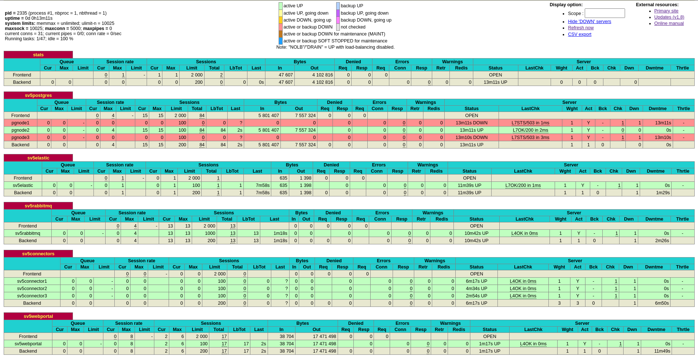
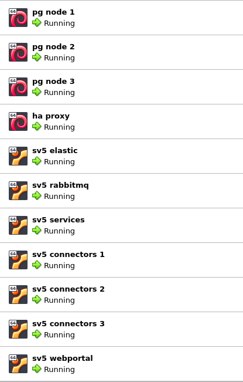
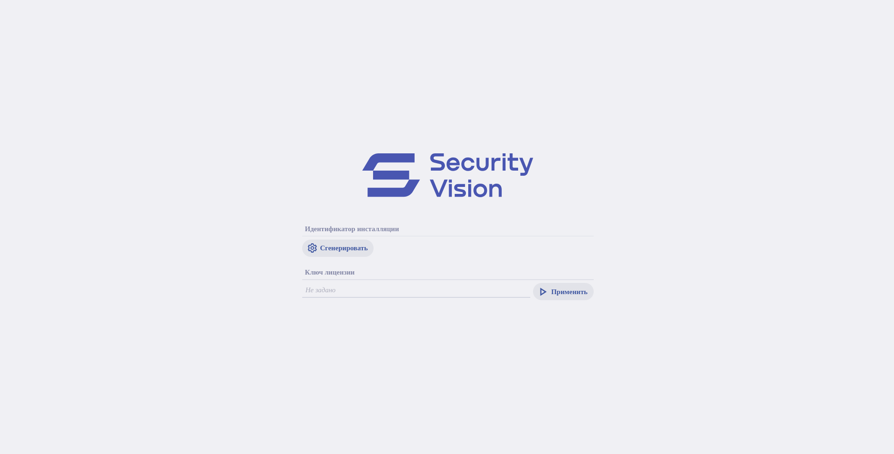

# Pre-requirement

*Third-party software*
* Oracle VM VirtualBox
* Vagrant by HashiCorp

*SecurityVision installer*
* redist folder (unpack and put in `distr` folder of this project)
* installer-console.v5 (rename downloaded installer and put in `distr` folder of this project)

# Deployment

* Start deployment with `vagrant up` command

# Screenshots

